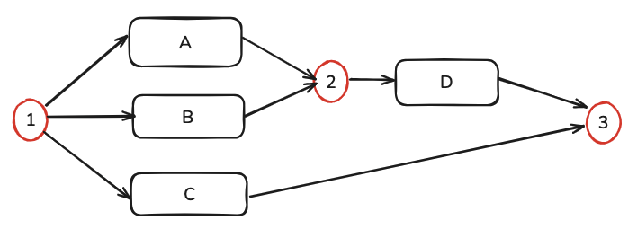

## 一、WBpm是什么？

WBpm实现了基本的bpm功能，是一个MVP的实现，实际生产还需要使用像Activiti、Flowable、Camunda之类的专业框架+业务对接二次开发。

作为一个最简化实现，设计意图在于加深对bpm流程引擎的理解，WBpm针对商用流程引擎的一些功能做了针对性的实现：

- 流程定义：通过api定义，无可视化
- 流程存储：随用随写，加载内存中，无持久化
- 监听器：节点的流入流出配置监听器，可进行节点属性修改以及业务通知
- 过滤器：每个节点可以配置过滤器，默认过滤器有：活跃检测过滤器、日志过滤器
- 流程变量：提供基本的全局流程变量机制
- API：提供基本的流程定义、流程实例、活跃任务、用户任务、操作用户任务的API接口，用于`<引擎> - <业务>`之间的对接
- 流程节点：本实现提供基本的节点类型
  - 起始节点：用于整个流程的起始
  - 结束节点：用于整个流程的结束
  - UserTaskNode：用户任务节点，节点进入后会等待用户操作，然后再流转到下一个节点
  - 网关节点：
    - ExclusiveGateway：互斥网关，多个入口，只有一个能执行
    - ParallelGateway：并行网关，多个入口，**全部执行和汇集**
    - InclusiveGateway：开放网关，多个入口，**按条件执行和汇集**

## 二、QuickStart

1. 拉取项目，启动springboot application

2. 访问如下接口：

```
# 所有定义的流程
localhost:10001/wbpm/process/defs
# 运行中的流程实例
localhost:10001/wbpm/process/running
# 获取指定用户tangwc需要处理的任务
localhost:10001/wbpm/getUserTask?userName=tangwc
# 完成指定用户+指定实例+指定节点的任务，让其流转到下一个节点
localhost:10001/wbpm/completeUserTask?userName=tangwc&instanceId=inst_1&nodeId=node_4

# 自动测试
# 也可访问autoTest接口，自动开启流程+流转
localhost:10001/wbpm/autoTest
```


测试代码绘制了如下流程：


流程定义api参考：

```java
public void init() {

        //最后需要中继到同一个节点，这里先定义
        InclusiveGateway inclusiveGateway = new InclusiveGateway("中继节点：等待大组长和财务审批完毕")
                .outTo(() -> true, new EndNode("结束节点"));


        //初始化，定义流程，启动流程
        ProcessEngine.load("demo1", new ProcessDefinition()
                .setName("出差申请")
                .setStart(new StartNode("起始节点")
                        .next(new UserTaskNode("提交申请")
                                .add(new UserTaskListenerAdapter() {
                                    @Override
                                    public void onFlowInto(UserTaskNode userTaskNode, ProcessInstanceContext context) {
                                        Object currUser = context.getVariables().get("currUser");
                                        if (currUser == null) {
                                            throw new RuntimeException("缺少变量");
                                        }
                                        //在这动态设置处理人
                                        userTaskNode.setAssignee((String) currUser);
                                    }
                                })
                                .next(new UserTaskNode("组长审批")
                                        .add(new UserTaskListenerAdapter() {
                                            @Override
                                            public void onFlowInto(UserTaskNode userTaskNode, ProcessInstanceContext context) {
                                                //这里可以动态获取提交人的组长，就不写了，直接写死
                                                //在这动态设置处理人
                                                userTaskNode.setAssignee("zhangsan");
                                            }
                                        })
                                        //下一个节点，需要两个人同时审批通过才能提交
                                        .next(new InclusiveGateway("中继节点：同时分发给大组长和财务审批")

                                                //大组长审批
                                                .outTo(new Supplier<Boolean>() {
                                                           @Override
                                                           public Boolean get() {
                                                               //大组长请假了，这里返回false，即不走大组长审批
                                                               return false;
                                                           }
                                                       }, new UserTaskNode("大组长审批")
                                                                .setAssignee("lisi")
                                                                .add(new UserTaskListenerAdapter() {
                                                                    @Override
                                                                    public void onFlowInto(UserTaskNode userTaskNode, ProcessInstanceContext context) {
                                                                        //这里还可以发邮件通知，或者push推送
                                                                        System.out.println("请通知：" + userTaskNode.getAssignee() + "，审批出差申请~~~~~~~");
                                                                    }
                                                                })
                                                                //到下一个协调节点，也是Inclusive网关节点，等待大组长审核完成之后，再放行下一个流程。
                                                                //注意，这里要next到同一个节点，
                                                                .next(inclusiveGateway)
                                                )
                                                //财务审批
                                                .outTo(() -> true, new UserTaskNode("财务审批")
                                                        .setAssignee("rose")
                                                        .add(new UserTaskListenerAdapter() {
                                                            @Override
                                                            public void onFlowInto(UserTaskNode userTaskNode, ProcessInstanceContext context) {
                                                                //这里还可以发邮件通知，或者push推送
                                                                System.out.println("请通知：" + userTaskNode.getAssignee() + "，审批出差申请~~~~~~~");
                                                            }
                                                        })
                                                        //到下一个协调节点，也是Inclusive网关节点，等待财务审核完成之后，再放行下一个流程。
                                                        //注意，这里要next到同一个节点，
                                                        .next(inclusiveGateway)
                                                )

                                        )
                                )

                        )
                )
        );


        ProcessInstance instance = startProcess();

        System.out.println("流程启动成功：" + JsonUtils.toJson(instance));
    }
```


## 三、核心原理

参考Activiti7的原理，本项目实现了一个最简化的**bpm马达**（还不能称之为引擎）

首先看下activiti7的设计

### 1. activiti7设计

activiti7中有如下几个关键概念：

- deployment：部署，即从bpmn文件加载到db中的行为
- processDefinition：由deployment产生，部署的实际就是流程定义，一次部署包含1-N个流程定义
- processInstance：流程实例，开启一个流程就是实例，类似于Java中的通过类定义创建一个对象实例
- execution：执行实例，概念要小于流程实例，即一个流程实例可以衍生多个执行实例
- task：任务，即一个流程节点，每个执行实例串联了多个任务

activiti7中关键的库表结构：

- general库：通用库，存储共性的东西

  - bytearray表：`.bpmn`文件的二进制存储，还可以存一些图片啥的

- history库：历史记录表

  - act_inst表：历史事件表，所有发生过的事件都在这
  - identity_link表：历史关联的用户的信息都在这
  - procinst表：历史流程实例
  - taskinst：历史任务实例
  - varinst：历史的变量

- repository库：仓库，记录部署和流程定义

  - deployment：部署表
  - processDef：流程定义

- runtime库：运行时的状态

  - Identity_link：当前运行时关联的用户信息
  - execution：当前活跃的执行实例
  - task：当前活跃的节点任务

  

整个运行示意图如下：


### 2. wbpm设计

wbpm核心概念：

- processDefinition：流程定义
- processInst：流程实例，一个流程可以同时开启多个实例
- processInstContext：流程执行上下文，和实例一一对应


#### 2.1 InclusiveGateway设计

##### 2.1.1 功能

开放网关需要实现的功能为：多个入口，**按条件执行和汇集**。即同步节点的处理速率，根据实际运行情况，对流出网关的输出的task进行阻塞，且没触发的节点不会被等待，类似于exclusive和parallel的结合。



如上图，1网关触发A,C，2网关只会等待A的执行，3网关需要等待A,C,D全部执行完毕才执行。

##### 2.1.2 设计实现

1. 每个网关，流出时，对每个流出的节点发放一张ticket，该ticket沿着路径一直往下， 在每个网关进行记录，比如2网关，记录 TicketSet[A]，3网关记录TicketSet[D,C]
2. 等A执行完毕之后，触发2，2判断TicketSet只有A，则立即放行
3. 同样2放行时候，也会触发Ticket传播，3网关会记录TicketSet[D,C]，其中D去重处理了
4. 这样，之后需要等待C、D都执行完毕之后，才会触发3网关的放行
5. **设计的核心思路是在前一个网关放行时，将放行信息顺链路广播到下游的网关。**


## 附录：demo执行日志

执行日志摘取如下

```
出差申请:inst_1执行完毕，日志如下：
执行日志:>>>>>>>>>流程进入：{
  "id" : "node_3",
  "name" : "起始节点",
  "complete" : false,
  "next" : {
    "id" : "node_4",
    "name" : "提交申请",
    "complete" : false,
    "assignee" : null,
    "next" : {
      "id" : "node_5",
      "name" : "组长审批",
      "complete" : false,
      "assignee" : null,
      "next" : {
        "id" : "node_6",
        "name" : "中继节点：同时分发给大组长和财务审批",
        "complete" : false,
        "outTos" : [ {
          "condition" : { },
          "userTaskNode" : {
            "id" : "node_7",
            "name" : "大组长审批",
            "complete" : false,
            "assignee" : "lisi",
            "next" : {
              "id" : "node_1",
              "name" : "中继节点：等待大组长和财务审批完毕",
              "complete" : false,
              "outTos" : [ {
                "condition" : { },
                "userTaskNode" : {
                  "id" : "node_2",
                  "name" : "结束节点",
                  "complete" : false
                }
              } ]
            }
          }
        }, {
          "condition" : { },
          "userTaskNode" : {
            "id" : "node_8",
            "name" : "财务审批",
            "complete" : false,
            "assignee" : "rose",
            "next" : {
              "id" : "node_1",
              "name" : "中继节点：等待大组长和财务审批完毕",
              "complete" : false,
              "outTos" : [ {
                "condition" : { },
                "userTaskNode" : {
                  "id" : "node_2",
                  "name" : "结束节点",
                  "complete" : false
                }
              } ]
            }
          }
        } ]
      }
    }
  }
}, 上一个节点：null
执行日志:>>>>>>>>>流程流出：{
  "id" : "node_3",
  "name" : "起始节点",
  "complete" : true,
  "next" : {
    "id" : "node_4",
    "name" : "提交申请",
    "complete" : false,
    "assignee" : null,
    "next" : {
      "id" : "node_5",
      "name" : "组长审批",
      "complete" : false,
      "assignee" : null,
      "next" : {
        "id" : "node_6",
        "name" : "中继节点：同时分发给大组长和财务审批",
        "complete" : false,
        "outTos" : [ {
          "condition" : { },
          "userTaskNode" : {
            "id" : "node_7",
            "name" : "大组长审批",
            "complete" : false,
            "assignee" : "lisi",
            "next" : {
              "id" : "node_1",
              "name" : "中继节点：等待大组长和财务审批完毕",
              "complete" : false,
              "outTos" : [ {
                "condition" : { },
                "userTaskNode" : {
                  "id" : "node_2",
                  "name" : "结束节点",
                  "complete" : false
                }
              } ]
            }
          }
        }, {
          "condition" : { },
          "userTaskNode" : {
            "id" : "node_8",
            "name" : "财务审批",
            "complete" : false,
            "assignee" : "rose",
            "next" : {
              "id" : "node_1",
              "name" : "中继节点：等待大组长和财务审批完毕",
              "complete" : false,
              "outTos" : [ {
                "condition" : { },
                "userTaskNode" : {
                  "id" : "node_2",
                  "name" : "结束节点",
                  "complete" : false
                }
              } ]
            }
          }
        } ]
      }
    }
  }
}
执行日志:>>>>>>>>>流程进入：{
  "id" : "node_4",
  "name" : "提交申请",
  "complete" : false,
  "assignee" : null,
  "next" : {
    "id" : "node_5",
    "name" : "组长审批",
    "complete" : false,
    "assignee" : null,
    "next" : {
      "id" : "node_6",
      "name" : "中继节点：同时分发给大组长和财务审批",
      "complete" : false,
      "outTos" : [ {
        "condition" : { },
        "userTaskNode" : {
          "id" : "node_7",
          "name" : "大组长审批",
          "complete" : false,
          "assignee" : "lisi",
          "next" : {
            "id" : "node_1",
            "name" : "中继节点：等待大组长和财务审批完毕",
            "complete" : false,
            "outTos" : [ {
              "condition" : { },
              "userTaskNode" : {
                "id" : "node_2",
                "name" : "结束节点",
                "complete" : false
              }
            } ]
          }
        }
      }, {
        "condition" : { },
        "userTaskNode" : {
          "id" : "node_8",
          "name" : "财务审批",
          "complete" : false,
          "assignee" : "rose",
          "next" : {
            "id" : "node_1",
            "name" : "中继节点：等待大组长和财务审批完毕",
            "complete" : false,
            "outTos" : [ {
              "condition" : { },
              "userTaskNode" : {
                "id" : "node_2",
                "name" : "结束节点",
                "complete" : false
              }
            } ]
          }
        }
      } ]
    }
  }
}, 上一个节点：{
  "id" : "node_3",
  "name" : "起始节点",
  "complete" : true,
  "next" : {
    "id" : "node_4",
    "name" : "提交申请",
    "complete" : false,
    "assignee" : null,
    "next" : {
      "id" : "node_5",
      "name" : "组长审批",
      "complete" : false,
      "assignee" : null,
      "next" : {
        "id" : "node_6",
        "name" : "中继节点：同时分发给大组长和财务审批",
        "complete" : false,
        "outTos" : [ {
          "condition" : { },
          "userTaskNode" : {
            "id" : "node_7",
            "name" : "大组长审批",
            "complete" : false,
            "assignee" : "lisi",
            "next" : {
              "id" : "node_1",
              "name" : "中继节点：等待大组长和财务审批完毕",
              "complete" : false,
              "outTos" : [ {
                "condition" : { },
                "userTaskNode" : {
                  "id" : "node_2",
                  "name" : "结束节点",
                  "complete" : false
                }
              } ]
            }
          }
        }, {
          "condition" : { },
          "userTaskNode" : {
            "id" : "node_8",
            "name" : "财务审批",
            "complete" : false,
            "assignee" : "rose",
            "next" : {
              "id" : "node_1",
              "name" : "中继节点：等待大组长和财务审批完毕",
              "complete" : false,
              "outTos" : [ {
                "condition" : { },
                "userTaskNode" : {
                  "id" : "node_2",
                  "name" : "结束节点",
                  "complete" : false
                }
              } ]
            }
          }
        } ]
      }
    }
  }
}
执行日志:>>>>>>>>>流程流出：{
  "id" : "node_4",
  "name" : "提交申请",
  "complete" : true,
  "assignee" : "tangwc",
  "next" : {
    "id" : "node_5",
    "name" : "组长审批",
    "complete" : false,
    "assignee" : null,
    "next" : {
      "id" : "node_6",
      "name" : "中继节点：同时分发给大组长和财务审批",
      "complete" : false,
      "outTos" : [ {
        "condition" : { },
        "userTaskNode" : {
          "id" : "node_7",
          "name" : "大组长审批",
          "complete" : false,
          "assignee" : "lisi",
          "next" : {
            "id" : "node_1",
            "name" : "中继节点：等待大组长和财务审批完毕",
            "complete" : false,
            "outTos" : [ {
              "condition" : { },
              "userTaskNode" : {
                "id" : "node_2",
                "name" : "结束节点",
                "complete" : false
              }
            } ]
          }
        }
      }, {
        "condition" : { },
        "userTaskNode" : {
          "id" : "node_8",
          "name" : "财务审批",
          "complete" : false,
          "assignee" : "rose",
          "next" : {
            "id" : "node_1",
            "name" : "中继节点：等待大组长和财务审批完毕",
            "complete" : false,
            "outTos" : [ {
              "condition" : { },
              "userTaskNode" : {
                "id" : "node_2",
                "name" : "结束节点",
                "complete" : false
              }
            } ]
          }
        }
      } ]
    }
  }
}
执行日志:>>>>>>>>>流程进入：{
  "id" : "node_5",
  "name" : "组长审批",
  "complete" : false,
  "assignee" : null,
  "next" : {
    "id" : "node_6",
    "name" : "中继节点：同时分发给大组长和财务审批",
    "complete" : false,
    "outTos" : [ {
      "condition" : { },
      "userTaskNode" : {
        "id" : "node_7",
        "name" : "大组长审批",
        "complete" : false,
        "assignee" : "lisi",
        "next" : {
          "id" : "node_1",
          "name" : "中继节点：等待大组长和财务审批完毕",
          "complete" : false,
          "outTos" : [ {
            "condition" : { },
            "userTaskNode" : {
              "id" : "node_2",
              "name" : "结束节点",
              "complete" : false
            }
          } ]
        }
      }
    }, {
      "condition" : { },
      "userTaskNode" : {
        "id" : "node_8",
        "name" : "财务审批",
        "complete" : false,
        "assignee" : "rose",
        "next" : {
          "id" : "node_1",
          "name" : "中继节点：等待大组长和财务审批完毕",
          "complete" : false,
          "outTos" : [ {
            "condition" : { },
            "userTaskNode" : {
              "id" : "node_2",
              "name" : "结束节点",
              "complete" : false
            }
          } ]
        }
      }
    } ]
  }
}, 上一个节点：{
  "id" : "node_4",
  "name" : "提交申请",
  "complete" : true,
  "assignee" : "tangwc",
  "next" : {
    "id" : "node_5",
    "name" : "组长审批",
    "complete" : false,
    "assignee" : null,
    "next" : {
      "id" : "node_6",
      "name" : "中继节点：同时分发给大组长和财务审批",
      "complete" : false,
      "outTos" : [ {
        "condition" : { },
        "userTaskNode" : {
          "id" : "node_7",
          "name" : "大组长审批",
          "complete" : false,
          "assignee" : "lisi",
          "next" : {
            "id" : "node_1",
            "name" : "中继节点：等待大组长和财务审批完毕",
            "complete" : false,
            "outTos" : [ {
              "condition" : { },
              "userTaskNode" : {
                "id" : "node_2",
                "name" : "结束节点",
                "complete" : false
              }
            } ]
          }
        }
      }, {
        "condition" : { },
        "userTaskNode" : {
          "id" : "node_8",
          "name" : "财务审批",
          "complete" : false,
          "assignee" : "rose",
          "next" : {
            "id" : "node_1",
            "name" : "中继节点：等待大组长和财务审批完毕",
            "complete" : false,
            "outTos" : [ {
              "condition" : { },
              "userTaskNode" : {
                "id" : "node_2",
                "name" : "结束节点",
                "complete" : false
              }
            } ]
          }
        }
      } ]
    }
  }
}
执行日志:>>>>>>>>>流程流出：{
  "id" : "node_5",
  "name" : "组长审批",
  "complete" : true,
  "assignee" : "zhangsan",
  "next" : {
    "id" : "node_6",
    "name" : "中继节点：同时分发给大组长和财务审批",
    "complete" : false,
    "outTos" : [ {
      "condition" : { },
      "userTaskNode" : {
        "id" : "node_7",
        "name" : "大组长审批",
        "complete" : false,
        "assignee" : "lisi",
        "next" : {
          "id" : "node_1",
          "name" : "中继节点：等待大组长和财务审批完毕",
          "complete" : false,
          "outTos" : [ {
            "condition" : { },
            "userTaskNode" : {
              "id" : "node_2",
              "name" : "结束节点",
              "complete" : false
            }
          } ]
        }
      }
    }, {
      "condition" : { },
      "userTaskNode" : {
        "id" : "node_8",
        "name" : "财务审批",
        "complete" : false,
        "assignee" : "rose",
        "next" : {
          "id" : "node_1",
          "name" : "中继节点：等待大组长和财务审批完毕",
          "complete" : false,
          "outTos" : [ {
            "condition" : { },
            "userTaskNode" : {
              "id" : "node_2",
              "name" : "结束节点",
              "complete" : false
            }
          } ]
        }
      }
    } ]
  }
}
执行日志:>>>>>>>>>流程进入：{
  "id" : "node_6",
  "name" : "中继节点：同时分发给大组长和财务审批",
  "complete" : false,
  "outTos" : [ {
    "condition" : { },
    "userTaskNode" : {
      "id" : "node_7",
      "name" : "大组长审批",
      "complete" : false,
      "assignee" : "lisi",
      "next" : {
        "id" : "node_1",
        "name" : "中继节点：等待大组长和财务审批完毕",
        "complete" : false,
        "outTos" : [ {
          "condition" : { },
          "userTaskNode" : {
            "id" : "node_2",
            "name" : "结束节点",
            "complete" : false
          }
        } ]
      }
    }
  }, {
    "condition" : { },
    "userTaskNode" : {
      "id" : "node_8",
      "name" : "财务审批",
      "complete" : false,
      "assignee" : "rose",
      "next" : {
        "id" : "node_1",
        "name" : "中继节点：等待大组长和财务审批完毕",
        "complete" : false,
        "outTos" : [ {
          "condition" : { },
          "userTaskNode" : {
            "id" : "node_2",
            "name" : "结束节点",
            "complete" : false
          }
        } ]
      }
    }
  } ]
}, 上一个节点：{
  "id" : "node_5",
  "name" : "组长审批",
  "complete" : true,
  "assignee" : "zhangsan",
  "next" : {
    "id" : "node_6",
    "name" : "中继节点：同时分发给大组长和财务审批",
    "complete" : false,
    "outTos" : [ {
      "condition" : { },
      "userTaskNode" : {
        "id" : "node_7",
        "name" : "大组长审批",
        "complete" : false,
        "assignee" : "lisi",
        "next" : {
          "id" : "node_1",
          "name" : "中继节点：等待大组长和财务审批完毕",
          "complete" : false,
          "outTos" : [ {
            "condition" : { },
            "userTaskNode" : {
              "id" : "node_2",
              "name" : "结束节点",
              "complete" : false
            }
          } ]
        }
      }
    }, {
      "condition" : { },
      "userTaskNode" : {
        "id" : "node_8",
        "name" : "财务审批",
        "complete" : false,
        "assignee" : "rose",
        "next" : {
          "id" : "node_1",
          "name" : "中继节点：等待大组长和财务审批完毕",
          "complete" : false,
          "outTos" : [ {
            "condition" : { },
            "userTaskNode" : {
              "id" : "node_2",
              "name" : "结束节点",
              "complete" : false
            }
          } ]
        }
      }
    } ]
  }
}
执行日志:>>>>>>>>>流程流出：{
  "id" : "node_6",
  "name" : "中继节点：同时分发给大组长和财务审批",
  "complete" : true,
  "outTos" : [ {
    "condition" : { },
    "userTaskNode" : {
      "id" : "node_7",
      "name" : "大组长审批",
      "complete" : false,
      "assignee" : "lisi",
      "next" : {
        "id" : "node_1",
        "name" : "中继节点：等待大组长和财务审批完毕",
        "complete" : false,
        "outTos" : [ {
          "condition" : { },
          "userTaskNode" : {
            "id" : "node_2",
            "name" : "结束节点",
            "complete" : false
          }
        } ]
      }
    }
  }, {
    "condition" : { },
    "userTaskNode" : {
      "id" : "node_8",
      "name" : "财务审批",
      "complete" : false,
      "assignee" : "rose",
      "next" : {
        "id" : "node_1",
        "name" : "中继节点：等待大组长和财务审批完毕",
        "complete" : false,
        "outTos" : [ {
          "condition" : { },
          "userTaskNode" : {
            "id" : "node_2",
            "name" : "结束节点",
            "complete" : false
          }
        } ]
      }
    }
  } ]
}
执行日志:>>>>>>>>>流程进入：{
  "id" : "node_8",
  "name" : "财务审批",
  "complete" : false,
  "assignee" : "rose",
  "next" : {
    "id" : "node_1",
    "name" : "中继节点：等待大组长和财务审批完毕",
    "complete" : false,
    "outTos" : [ {
      "condition" : { },
      "userTaskNode" : {
        "id" : "node_2",
        "name" : "结束节点",
        "complete" : false
      }
    } ]
  }
}, 上一个节点：{
  "id" : "node_6",
  "name" : "中继节点：同时分发给大组长和财务审批",
  "complete" : true,
  "outTos" : [ {
    "condition" : { },
    "userTaskNode" : {
      "id" : "node_7",
      "name" : "大组长审批",
      "complete" : false,
      "assignee" : "lisi",
      "next" : {
        "id" : "node_1",
        "name" : "中继节点：等待大组长和财务审批完毕",
        "complete" : false,
        "outTos" : [ {
          "condition" : { },
          "userTaskNode" : {
            "id" : "node_2",
            "name" : "结束节点",
            "complete" : false
          }
        } ]
      }
    }
  }, {
    "condition" : { },
    "userTaskNode" : {
      "id" : "node_8",
      "name" : "财务审批",
      "complete" : false,
      "assignee" : "rose",
      "next" : {
        "id" : "node_1",
        "name" : "中继节点：等待大组长和财务审批完毕",
        "complete" : false,
        "outTos" : [ {
          "condition" : { },
          "userTaskNode" : {
            "id" : "node_2",
            "name" : "结束节点",
            "complete" : false
          }
        } ]
      }
    }
  } ]
}
执行日志:>>>>>>>>>流程流出：{
  "id" : "node_8",
  "name" : "财务审批",
  "complete" : true,
  "assignee" : "rose",
  "next" : {
    "id" : "node_1",
    "name" : "中继节点：等待大组长和财务审批完毕",
    "complete" : false,
    "outTos" : [ {
      "condition" : { },
      "userTaskNode" : {
        "id" : "node_2",
        "name" : "结束节点",
        "complete" : false
      }
    } ]
  }
}
执行日志:>>>>>>>>>流程进入：{
  "id" : "node_1",
  "name" : "中继节点：等待大组长和财务审批完毕",
  "complete" : false,
  "outTos" : [ {
    "condition" : { },
    "userTaskNode" : {
      "id" : "node_2",
      "name" : "结束节点",
      "complete" : false
    }
  } ]
}, 上一个节点：{
  "id" : "node_8",
  "name" : "财务审批",
  "complete" : true,
  "assignee" : "rose",
  "next" : {
    "id" : "node_1",
    "name" : "中继节点：等待大组长和财务审批完毕",
    "complete" : false,
    "outTos" : [ {
      "condition" : { },
      "userTaskNode" : {
        "id" : "node_2",
        "name" : "结束节点",
        "complete" : false
      }
    } ]
  }
}
执行日志:>>>>>>>>>流程流出：{
  "id" : "node_1",
  "name" : "中继节点：等待大组长和财务审批完毕",
  "complete" : true,
  "outTos" : [ {
    "condition" : { },
    "userTaskNode" : {
      "id" : "node_2",
      "name" : "结束节点",
      "complete" : false
    }
  } ]
}
执行日志:>>>>>>>>>流程进入：{
  "id" : "node_2",
  "name" : "结束节点",
  "complete" : false
}, 上一个节点：{
  "id" : "node_1",
  "name" : "中继节点：等待大组长和财务审批完毕",
  "complete" : true,
  "outTos" : [ {
    "condition" : { },
    "userTaskNode" : {
      "id" : "node_2",
      "name" : "结束节点",
      "complete" : false
    }
  } ]
}
执行日志:>>>>>>>>>流程即将结束：{
  "finished" : false,
  "variables" : {
    "currUser" : "tangwc"
  },
  "active" : [ {
    "id" : "node_2",
    "name" : "结束节点",
    "complete" : false
  } ],
  "finishedListener" : [ { }, { } ]
}
执行日志:>>>>>>>>>流程流出：{
  "id" : "node_2",
  "name" : "结束节点",
  "complete" : true
}
```
